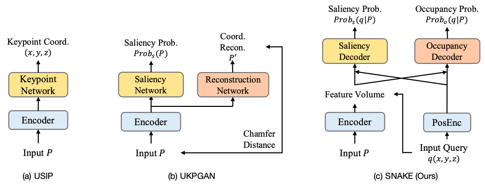
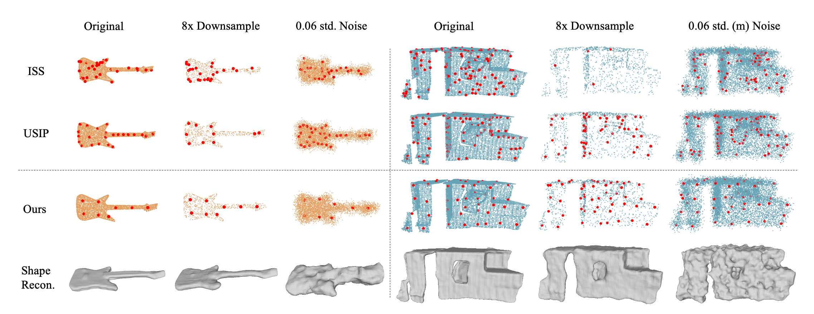
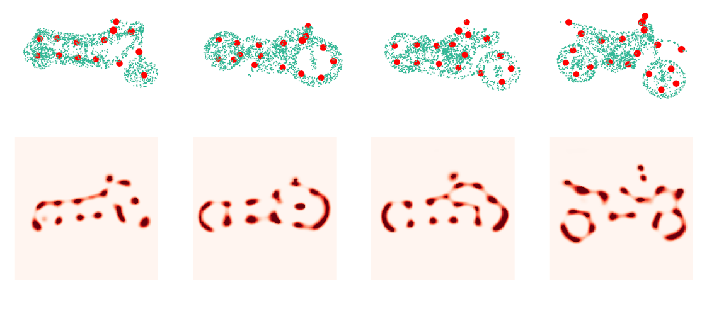

# SNAKE: Shape-aware Neural 3D Keypoint Field

This repository contains the implementation of the following [paper](https://arxiv.org/abs/2206.01724):

SNAKE: Shape-aware Neural 3D Keypoint Field  
[Chengliang Zhong](https://zhongcl-thu.github.io/), Peixing You, Xiaoxue Chen, [Hao Zhao](https://sites.google.com/view/fromandto), [Fuchun Sun](https://scholar.google.com/citations?user=DbviELoAAAAJ&hl=en), [Guyue Zhou](https://air.tsinghua.edu.cn/en/info/1046/1196.htm), Xiaodong Mu, [Chuang Gan](https://people.csail.mit.edu/ganchuang/), [Wenbing Huang](https://scholar.google.com/citations?user=0yNkmO4AAAAJ&hl=zh-CN)


<p align="center"></p>

<p align="center"></p>


If you find our code or paper useful, please consider citing:
```bibtex
@misc{zhong2022snake,
  author={Zhong, Chengliang and You, Peixing and Chen, Xiaoxue and Zhao, Hao and Sun, Fuchun and Zhou, Guyue and Mu, Xiaodong and Gan, Chuang and Huang, Wenbing},
  title={SNAKE: Shape-aware Neural 3D Keypoint Field},
  year={2022},
  eprint={2206.01724},
  archivePrefix={arXiv},
  primaryClass={cs.CV}
}
```


This repository is a PyTorch implementation.

## Datasets
KeypointNet dataset is provided by UKPGAN, which can be downloaded from [here](https://drive.google.com/drive/folders/1_d1TzZEF25Wy5kRj5ZugrgGeyf7xxu8F).

SMPL is a skinned vertex-based deformable model, where a link to download the mesh is [here](https://smpl.is.tue.mpg.de/index.html).

ModelNet40, 3DMatch, and Redwood datasets are provided by USIP. We provide a link to download [here](https://drive.google.com/drive/folders/1e3m4jZxtJmBbtPoL2nIYVGPN9G4-p8fg).

**Note**: Please move the dataset into the 'data' folder or modify the data paths in the codes (for example, modify 'data_path' (line 117) in the 'exp/KeypointNet/train0526/config.yaml'). 

Our 'data' folder structure is as follows:

```
data
  ├── keypointnet_pcds
  │    ├── 02691156
  │    ...
  │    ├── annotations
  ├── modelnet40
  │    ├── modelnet40-normal_numpy
  │    ├── modelnet40-test_rotated_numpy
  ├── smpl_model
  │    ├── model.pkl
  │    ├── pose_test_100.npy  (See details later.)
  │    ├── beta_test_100.npy  (See details later.)
  ├── 3DMatch_npy
  ├── 3DMatch_eval_downsample (See details later.)
  └── redwood
```


## Installation
Make sure that you have all dependencies in place. The simplest way to do so, is to use anaconda.

You can create an anaconda environment called SNAKE using
```
conda create --name SNAKE python=3.7
conda activate SNAKE
```

**Note**: Install python packages according to the CUDA version on your computer:
```
# CUDA >= 11.0
pip install -r requirements_cu11.txt 
pip install torch-scatter==2.0.9
# CUDA < 11.0
pip install -r requirements_cu10.txt 
pip install torch-scatter==2.0.4
```

Next, compile the extension modules.
You can do this via
```
python setup.py build_ext --inplace
```


## Training

Choose one of the dataset names [KeypointNet, SMPL, ModelNet40, Redwood] to replace '[dataset_name]'.

If train on single GPU, run:
```
sh exp/[dataset_name]/train0526/train_single.sh
```

If train on multiple GPUs, modify the values of 'CUDA_VISIBLE_DEVICES' and 'nproc_per_node' in the 'train_multi.sh' according to the number of available GPUs of yours and run:
```
sh exp/[dataset_name]/train0526/train_multi.sh
```

## Extract and Save Keypoints

```
sh exp/[dataset_name]/train0526/test.sh save_kpts
```

## Evaluate
### 1. Semantic Consistency

**Note**: Test on KeypointNet and SMPL. 

It takes some time to compute geodesic distances of input point clouds on KeypointNet. Download the test parameters ([pose_test_100.npy](https://drive.google.com/drive/folders/1i5lzEt6epYk2IfGJNESL3Tulbg6uH-PF?usp=sharing), [beta_test_100.npy](https://drive.google.com/drive/folders/1i5lzEt6epYk2IfGJNESL3Tulbg6uH-PF?usp=sharing)) for paired human shapes generation, and move them to *data/smpl_model/*. Then, run:
```
python tools/eval_iou.py --dataset [dataset_name] --test_root exp/[dataset_name]/[result_name]
```

For example:
```
python tools/eval_iou.py --dataset KeypointNet --test_root exp/KeypointNet/train0526/test_result/noise-0-down-1-grid64-nms0.1-sal0.7-occ0.8-update10-lr0.001-pad0.125
```

### 2. Repeatability

**Note**: Test on ModelNet40 and Redwood. 

Download the transformation matrix for each two-view point clouds([modelnet40](https://drive.google.com/file/d/1cR_d0VrD8vxI6gzDkqC_-DO5uVd9WVQD/view?usp=sharing), [redwood](https://drive.google.com/file/d/1hTsZ4Edd8MmxmYxUPzM0qK8PbCHrO3AR/view?usp=sharing)), and move them to *data/modelnet40/modelnet40-test_rotated_numpy/* and *data/redwood/numpy_gt_normal/* respectively. Then, run:
```
python tools/eval_repeat.py --test_dataset [dataset_name] --test_root exp/[dataset_name]/[result_name]
```

For example:
```
python tools/eval_repeat.py --dataset Redwood --test_root exp/Redwood/train0526/test_result/noise-0-down-1-grid100-nms0.04-sal0.7-occ0.8-update10-lr0.001-pad0.125
```

### 3. Registration

**Note**: Test on 3DMatch. 

Down-sample test data (see the repository from [D3feat](https://github.com/XuyangBai/D3Feat.pytorch)). The test data are renamed as '3DMatch_eval_downsample' and moved to *'data/'*.

Then, extract keypoints using the model trained on KeypointNet. Run: 
```
sh exp/KeypointNet/train0526_for_registration/test.sh save_kpts
```

Evaluate the registration performance using the repository from [D3feat](https://github.com/XuyangBai/D3Feat.pytorch).


## Visualization
Show predicted object/scene shape, run:
```
sh exp/[dataset_name]/train0526/test.sh show_occ
```

Show predicted saliency field slice, run:
```
sh exp/[dataset_name]/train0526/test.sh show_sal_slice
```

<p align="center"></p>


Show extract keypoints on the KeypointNet dataset, run:
```
python tools/show_kpts.py
```

Show surface reconstruction, run:
```
sh exp/[dataset_name]/train0526/test.sh show_recon
```


## Pretrained Models

We provide pretrained models on [Google Drive](https://drive.google.com/drive/folders/1i5lzEt6epYk2IfGJNESL3Tulbg6uH-PF?usp=sharing) and [Baidu Netdisk](https://pan.baidu.com/s/10HkbgFTGuQ4yPlZIOtdTMw): an3m. Move the models to *exp/[dataset_name]/train0526/checkpoints/*. 


## License

SNAKE is released under the MIT License.


## Acknowledgment

We would like to thank the open-source code of [R2D2](https://github.com/naver/r2d2), [ConvONet](https://github.com/autonomousvision/convolutional_occupancy_networks), [USIP](https://github.com/lijx10/USIP), [UKPGAN](https://github.com/qq456cvb/UKPGAN) and [D3feat](https://github.com/XuyangBai/D3Feat.pytorch).
